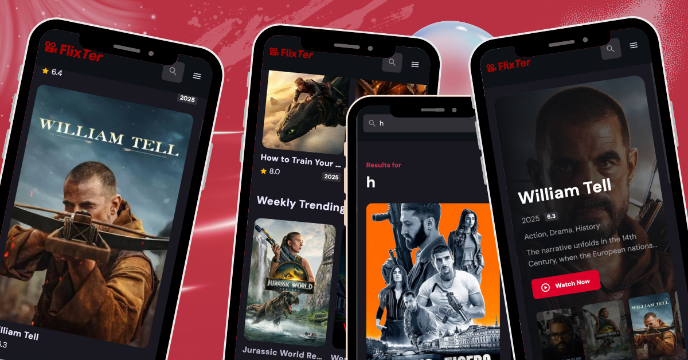

# Flixter 🎬

Flixter is a dynamic **web application** designed for movie enthusiasts. It allows users to **discover, explore, and review movies** with a sleek, intuitive interface. Powered by real-time movie data and personalized recommendations, Flixter makes exploring the world of cinema engaging and seamless.

---



---

## 🚀 Features

- Browse popular and trending movies
- Search for movies by title
- View detailed movie information (cast, genre, ratings)
- Add reviews and ratings for movies
- Personalized recommendations based on user preferences
- Responsive design for desktop and mobile

---

## 🛠 Tech Stack

- **Frontend:** React, Next.js, Tailwind CSS  
- **Backend:** Next.js API Routes  
- **Database:** (if applicable, e.g., MongoDB or Firebase)  
- **API:** The Movie Database (TMDB) API  
- **Authentication:** (if implemented) NextAuth.js  

---

## 💻 Getting Started

### 1. **Clone the repository**
   - To clone the project, open your terminal and run the following command:
     ```bash
     git clone https://github.com/AngelaGrozdanova/Flixter.git
     ```
